# Northwind Mutual — Compliance-Governed Claims Platform

Modular Terraform + Azure DevOps + Azure Policy, provisioning a
network-segmented claims-processing environment for a fictional insurer,
governed by Azure's real PCI DSS regulatory compliance initiative plus a
custom Canadian data-residency policy.

> **Disclaimer:** "Northwind Mutual" is a fictional company. All
> infrastructure, naming, and configuration in this project are for personal
> learning purposes only and do not represent or use any real systems, data,
> or processes from any actual insurance company or employer.

---

## What this project demonstrates

Anyone can write Terraform to create a virtual machine. The harder, more
valuable skill is *governing* infrastructure so it can't be created in a
non-compliant way in the first place, and *structuring* that infrastructure
the way a platform team actually would: as reusable building blocks, not a
single flat script.

This project provisions a small, network-segmented claims-processing
environment using reusable Terraform modules, deployed through Azure DevOps
pipelines with a human approval gate between plan and apply, and governed by
Azure's real built-in **PCI DSS v4.0.1 regulatory compliance initiative** —
the same one regulated companies actually assign — extended with a custom
**Canadian data residency** policy specific to a Canadian insurer's
regulatory context.

### Why PCI DSS and data residency specifically

Insurers process payments (premiums, payouts), so PCI DSS genuinely applies.
Canadian data residency reflects a real constraint for a Canadian insurer:
customer and claims data is expected to stay within Canadian borders. Using
Azure's *built-in, Microsoft-maintained* PCI DSS initiative — rather than
hand-writing equivalent rules — mirrors how a real compliance team would
work: adopt the recognized industry standard, then layer organization-specific
rules on top only where the standard doesn't already cover it.

### Project status

This is a from-scratch rebuild of an earlier draft (`insurance-iac-terraform`)
that proved the core pattern — Terraform, remote state, OIDC, a basic policy
— end to end. This version restructures that into reusable modules and
replaces the basic policy layer with the real PCI DSS initiative and network
segmentation described below.

---

## Architecture

### Governance and network structure

The compliance layer (PCI DSS plus Canadian data residency) is enforced at
the subscription level — it isn't a resource you can point at, it's a
standing rule that evaluates everything underneath it. Inside the resource
group, the virtual network is split into two segments:

- **Sensitive zone** (`snet-sensitive`) — holds the claims-processor VM and
  is governed by its own NSG. This is the project's equivalent of a PCI
  "cardholder data environment": the place sensitive data and its
  processing live, deliberately isolated.
- **General zone** (`snet-general`) — a general-purpose tier with its own
  NSG and baseline rules, but no VM. Network-only by design: the
  segmentation story is carried by the subnets and NSG rules, not by
  running a second VM, which keeps the realistic two-tier pattern at
  roughly the cost of one.

NSGs control exactly what traffic is allowed to cross between the two zones.

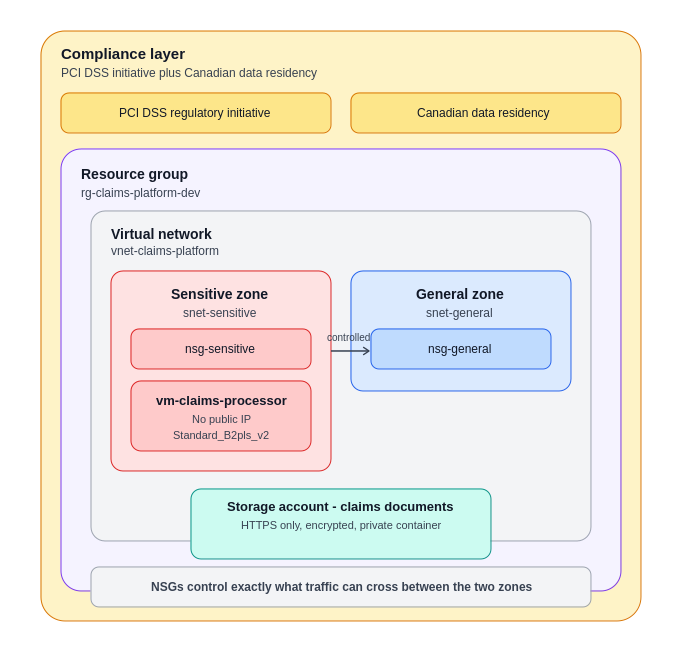

### Pipeline flow

Infrastructure is defined as three reusable Terraform modules —
`network`, `compute`, and `storage` — composed by a root environment
configuration rather than described directly. The Build Pipeline only ever
validates and plans: `terraform init` against the remote state backend,
`terraform validate`, then `terraform plan -out=tfplan`, publishing that
exact plan as a pipeline artifact. The Release Pipeline downloads that
artifact and applies it — first to a `staging` Azure DevOps Environment,
then it pauses at a manual approval gate before applying the *same* artifact
to `production`. The plan is never regenerated between staging and
production: what was reviewed is exactly what gets applied.

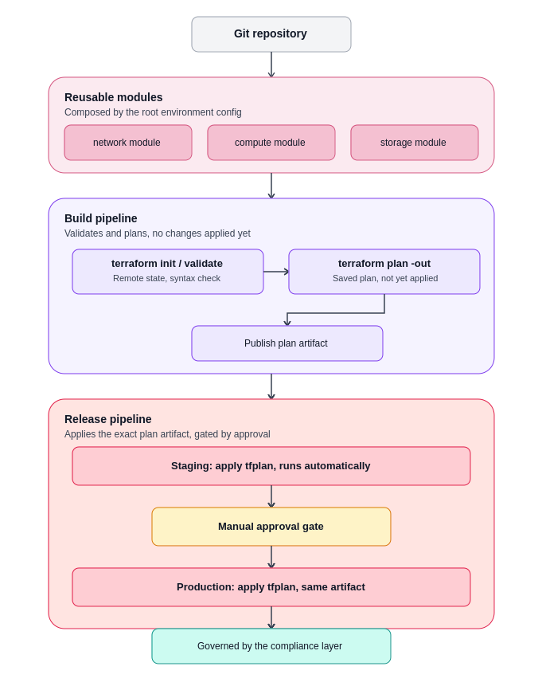

---

## Resource list

| Resource | Name | Module | Notes |
|---|---|---|---|
| Resource group | `rg-claims-platform-dev` | — | Single resource group for the dev environment |
| **Sensitive zone** | | | |
| Virtual network | `vnet-claims-platform` | `network` | One VNet, two subnets |
| Subnet | `snet-sensitive` (10.20.1.0/24) | `network` | Claims data and processing |
| Network security group | `nsg-sensitive` | `network` | Denies inbound except explicitly allowed traffic from the general zone |
| Network interface | `nic-claims-processor` | `compute` | No public IP |
| Virtual machine | `vm-claims-processor` (`Standard_B2pls_v2`, ARM64) | `compute` | The one real VM in the project; nothing runs on it, it exists to be governed |
| Storage account | `stclaimsdocs<unique>` | `storage` | Claims documents; HTTPS-only, encrypted, private |
| Storage container | `claims-documents` | `storage` | |
| **General zone** | | | |
| Subnet | `snet-general` (10.20.2.0/24) | `network` | App/general-purpose workloads |
| Network security group | `nsg-general` | `network` | Baseline rules, more permissive than the sensitive zone |
| — | (no VM) | — | Network-only, deliberately, to keep cost low |
| **Governance** | | | |
| Policy initiative assignment | PCI DSS v4.0.1 (built-in) | `policies` | Subscription scope, audit-only |
| Policy assignment | Canadian data residency, resources (built-in) | `policies` | Subscription scope, enforcing |
| Policy assignment | Canadian data residency, resource groups (built-in) | `policies` | Subscription scope, enforcing |

---

## Repository structure

```
/modules
  /network        # reusable: subnet, nsg, rules
  /compute        # reusable: nic, optional vm (toggle by input)
  /storage        # reusable: storage account + container, hardened
/environments
  /dev            # root config composing the modules for the dev environment
/policies         # PCI DSS initiative + Canadian data-residency assignments
/bootstrap        # documentation for the reused remote state backend
/pipelines        # Build and Release pipeline YAML, setup notes
```

The network module is instantiated twice in `environments/dev/main.tf` —
once for the sensitive zone, once for the general zone — with different
inputs each time. That reuse is the actual point: the same reviewed module
produces both segments, rather than two independently hand-written, easily
diverging copies. The compute module is similarly reused with a boolean
toggle (`create_vm`): the sensitive zone calls it with a VM, the general
zone calls it without one.

---

## State management and authentication

Terraform state is stored remotely in Azure Blob Storage, never locally —
state files can contain secrets and access tokens in plaintext, and in a
regulated insurance context state is treated with the same rigor as
customer PII. This project deliberately **reuses an existing state backend**
from an earlier related project rather than provisioning a redundant one —
see `bootstrap/README.md` for the full reasoning and the naming-collision
precautions taken.

Pipelines authenticate to Azure via **OIDC / Workload Identity
Federation through a managed identity** — no stored secret anywhere. See
`pipelines/oidc-setup.md` for the full setup and the comparison against an
earlier attempt using an app registration.

---

## The compliance initiative in practice

### Assignments overview

*Below: the Azure Portal's Policy → Assignments view, showing all four
subscription-level assignments together — the PCI DSS initiative, both
halves of the Canadian data-residency control, and Azure's own default
security initiative that ships on every subscription.*

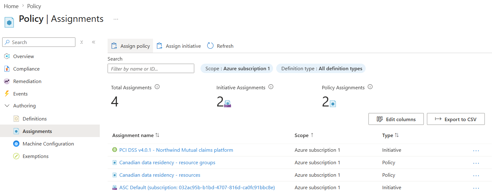

*Below: the same assignments confirmed independently via Azure CLI, as a
second, command-line source of truth rather than relying on the Portal
screen alone.*

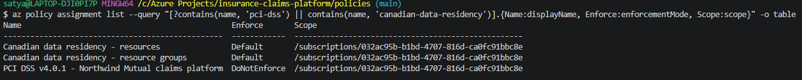

### Demonstrating enforcement — two independent denies

Azure's built-in "Allowed locations" policy governs where *resources* can be
created; the separate "Allowed locations for resource groups" policy governs
where *resource groups themselves* can be created. Both were assigned and
both were tested independently, to confirm each is genuinely doing its own
distinct job rather than one silently covering for the other.

*Below: an attempt to create a resource group in `eastus` (not an allowed
Canadian region), rejected by Azure before anything was created. The output
shows Azure Policy's actual evaluation trail — the specific rule, the actual
value found (`eastus`), and the allowed values it was checked against.*

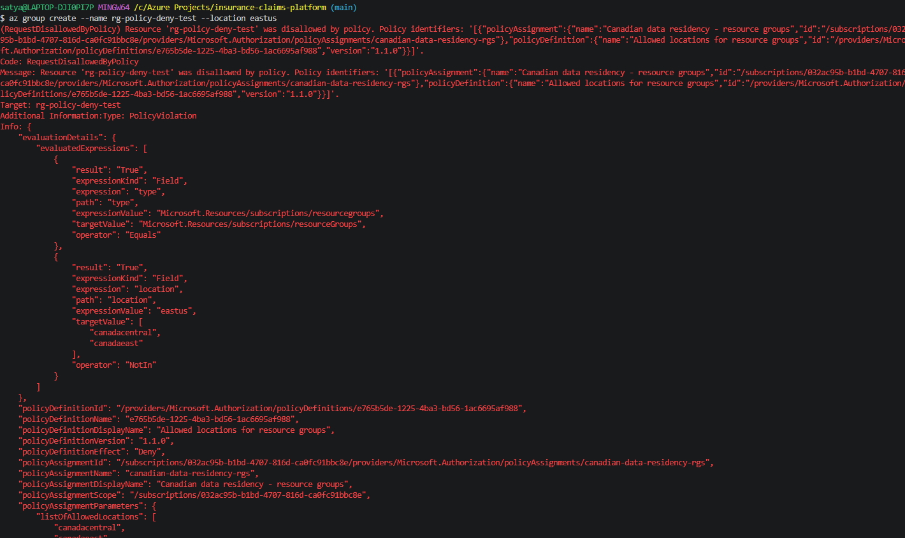

*Below: a second, separate attempt — this time creating a real resource
(a storage account) inside an already-correctly-located resource group, but
specifying `eastus` for the resource itself. Rejected by the *other* policy
assignment, confirming the two controls work independently.*

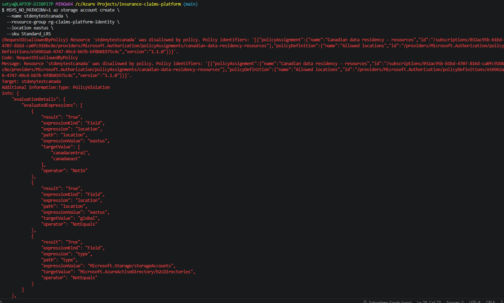

*Below: the same denial corroborated independently in the Azure Portal's
Activity Log — proving this is a real, audited control-plane decision with a
timestamp and the identity that triggered it, not just a CLI-side message.*

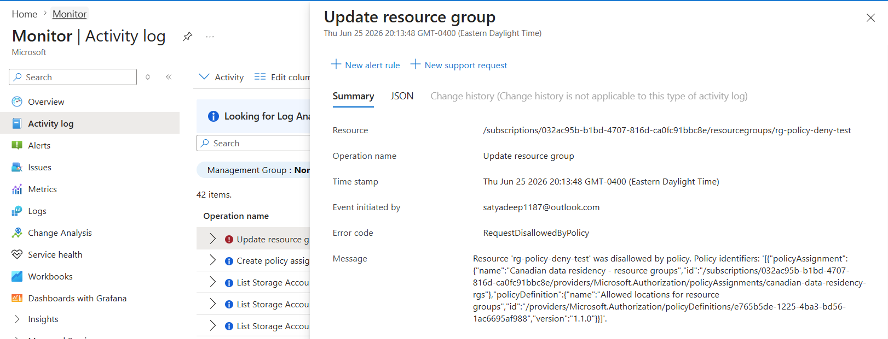

### PCI DSS compliance score

The PCI DSS v4.0.1 initiative is assigned in audit-only mode. Per
Microsoft's own guidance, the initial compliance evaluation across its many
member policies takes 24–48 hours to populate after assignment. *(This
section will be updated with the populated compliance dashboard once that
window has passed.)*

---

## CI/CD pipelines

### Build Pipeline

Validates and plans `environments/dev`, never applies anything.
`terraform init` (against the remote backend) → `terraform validate` →
`terraform plan -out=tfplan` → publish the plan as a pipeline artifact.
Triggers on changes to `environments/dev/*` or `modules/*` — module changes
are included because they change what gets planned even though they don't
touch the environment folder directly.

### Release Pipeline

Manually triggered, never automatic — applying real infrastructure is a
deliberate action. Downloads the *exact* plan artifact published by the
Build Pipeline (declared as a pipeline resource, since `download: current`
only reaches within the same pipeline) and applies it in a Staging stage,
then pauses at a Production stage requiring manual approval before
confirming the deployment. Staging and Production represent one real
environment's approval *workflow*, not two separate copies of the
infrastructure — the same cost-conscious simplification used elsewhere in
this project's design.

---

## Three real problems, found and fixed

Each of these is a genuine bug or gap hit during this project, not a
hypothetical — included because the diagnosis process is the actual signal,
not just the fix.

### 1. A hidden local-environment dependency (SSH key)

*Below: the Build Pipeline's first real run, failing immediately —
`No value for required variable "ssh_public_key_path"`.*

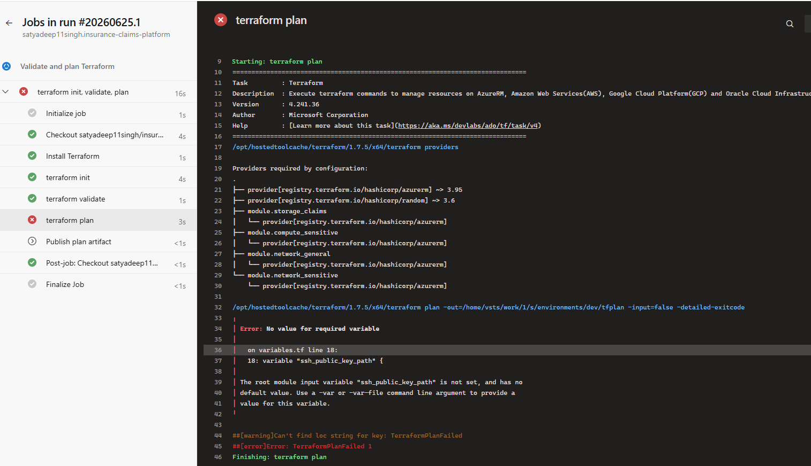

The VM's Terraform configuration required a path to a local SSH public key
file. Locally, a gitignored `terraform.tfvars` file supplied that value,
masking the fact that nothing in the actual checked-in configuration
provided one. The pipeline's clean checkout had no such file — and
correctly failed, because there genuinely was no value to use. The fix:
generate the key pair *inside* Terraform itself, using the `tls_private_key`
resource, removing the dependency on any local file entirely. This is also
the more honest design for this VM's actual purpose — nobody is meant to
SSH into it; it exists to be governed by policy, not logged into.

*Below: the corrected Build Pipeline publishing a clean plan artifact after
the fix.*

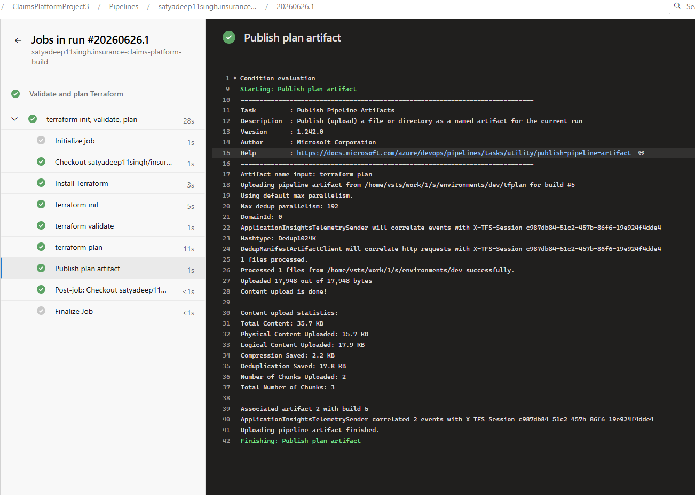

### 2. OIDC automatic mode failing against a pre-existing identity

Azure DevOps's "automatic" Workload Identity Federation setup failed with an
internal "strong box" error when pointed at an app registration created
ahead of time via the Azure CLI. Checking Microsoft's own troubleshooting
documentation confirmed this is a known, documented limitation: automatic
conversion can fail when Azure DevOps needs to write a federated credential
onto an identity it didn't create itself. Rather than work around this with
manual credential creation (the officially sanctioned but more manual path),
this project tested whether a **freshly-created managed identity** —
created and federated entirely within Azure DevOps's own automatic flow —
would avoid the conflict. It did, succeeding cleanly on the first attempt.

*Below: the working OIDC connection, automatically created against a fresh
managed identity. Note the "Manage Managed Identity" link, confirming the
identity type, and the real Issuer/Subject values Azure DevOps generated and
successfully registered.*

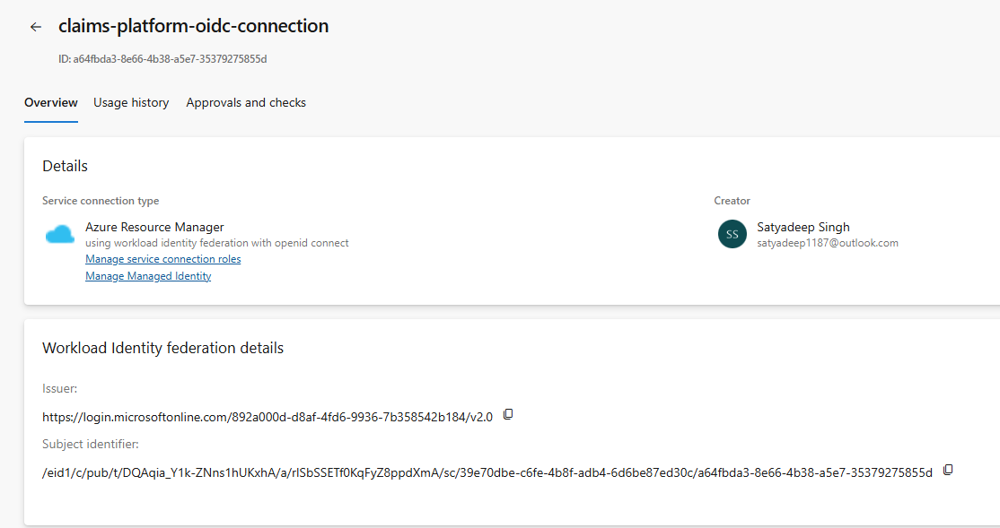

*Below: the managed identity's three role assignments, each scoped to
exactly what the pipeline needs and nothing more — Contributor and Resource
Policy Contributor at subscription scope, and Storage Blob Data Contributor
scoped narrowly to only the state backend storage account.*

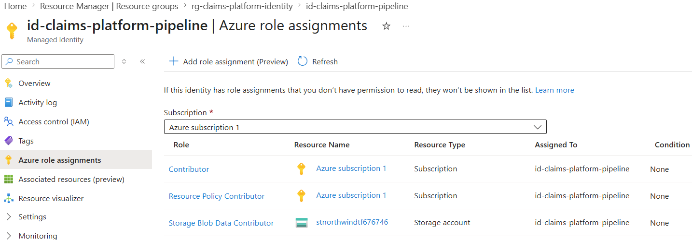

### 3. A genuine bug in the Terraform extension's deployment-job support

The Release Pipeline's Staging stage initially put the real `terraform
apply` work inside an Azure DevOps `deployment` job (required for
environment-linked approval gates). Every run failed identically with
`spawn .../terraform ENOENT`, even though a debug step confirmed the binary
genuinely existed, was executable, and was correctly on `PATH` moments
before the failure — ruling out an installation or path problem. Searching
against Microsoft's own `azure-pipelines-extensions` repository surfaced a
matching, still-open issue confirming this is a known bug in the Terraform
extension specific to deployment jobs, not a configuration mistake. The fix:
split the Staging stage into a plain job that does the actual Terraform
work (where the task functions correctly) and a separate, lightweight
deployment job that only records the deployment against the `staging`
Environment, with no Terraform tasks of its own.

*Below: confirmation the cross-pipeline plan artifact was found and
selectable before running, after declaring the Build Pipeline as a proper
pipeline resource.*

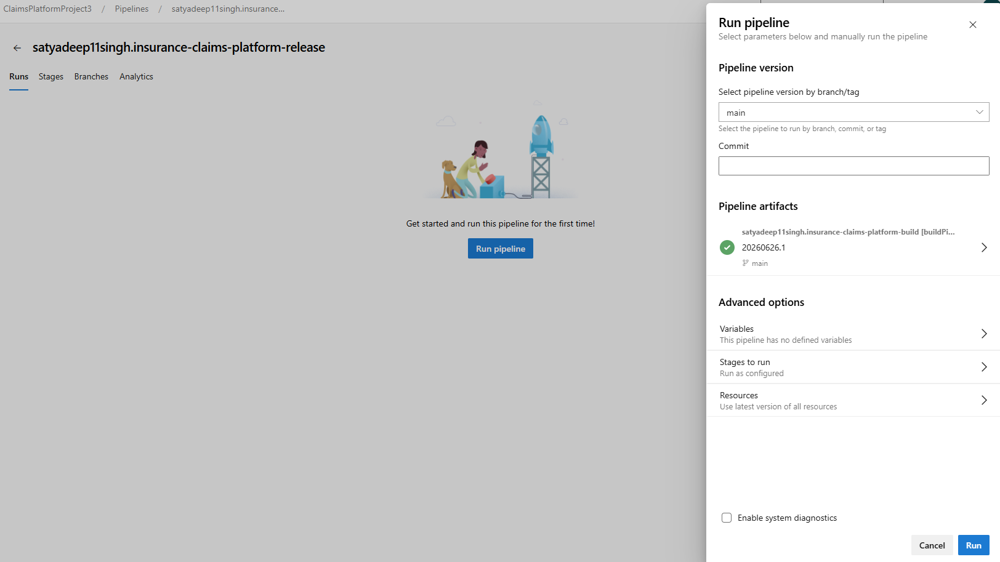

*Below: the fixed Staging stage running successfully end to end — Install
Terraform, download the plan artifact, init, and apply, all in a plain job;
followed by the separate, lightweight job that records the deployment.*

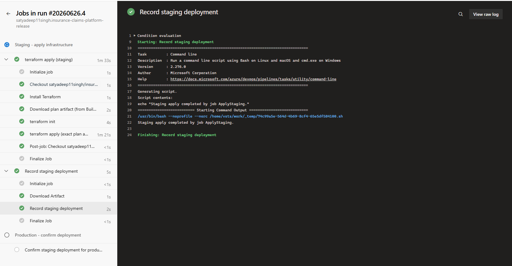

*Below: the Production stage paused, waiting for manual approval — the
actual gate, captured before approving it.*

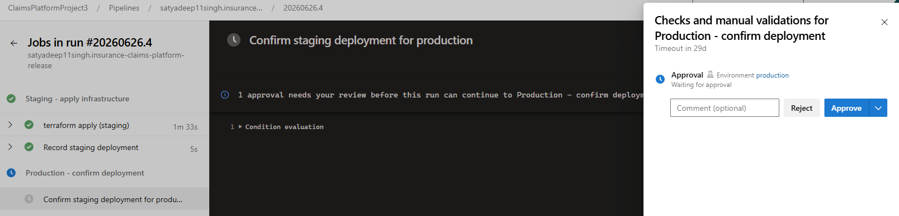

*Below: the complete run after approval — both stages green, the first
genuine end-to-end pipeline-driven deployment of this project.*

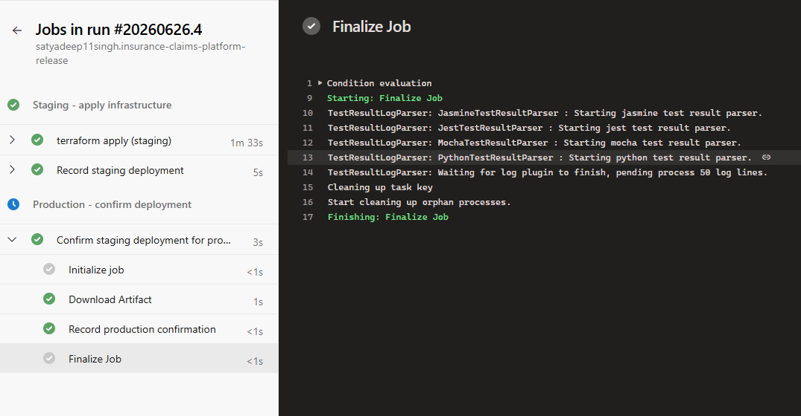

---

## Evidence the deployed infrastructure matches the design

*Below: `terraform apply` succeeding locally during initial validation,
before any of this was wired into a pipeline — confirming the Terraform
itself was correct in isolation.*

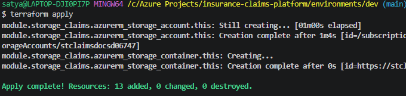

*Below: the resource group's Overview in the Azure Portal, listing the
resources this project actually created.*

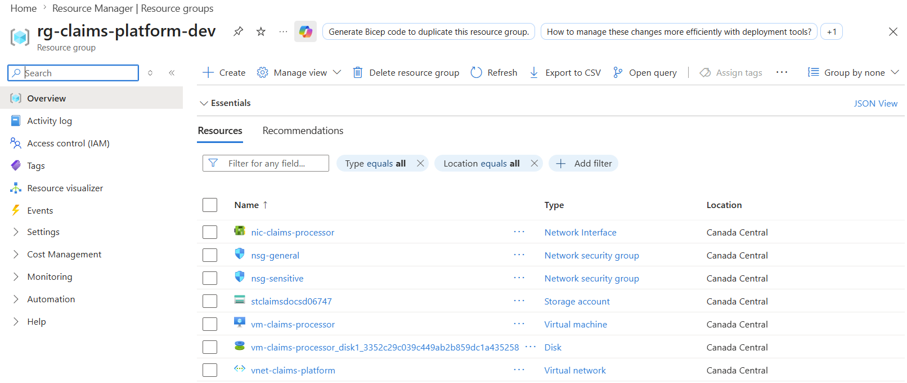

*Below: both subnets shown side by side — `snet-sensitive` and
`snet-general` with their distinct address ranges, the concrete proof the
two-tier segmentation exists.*

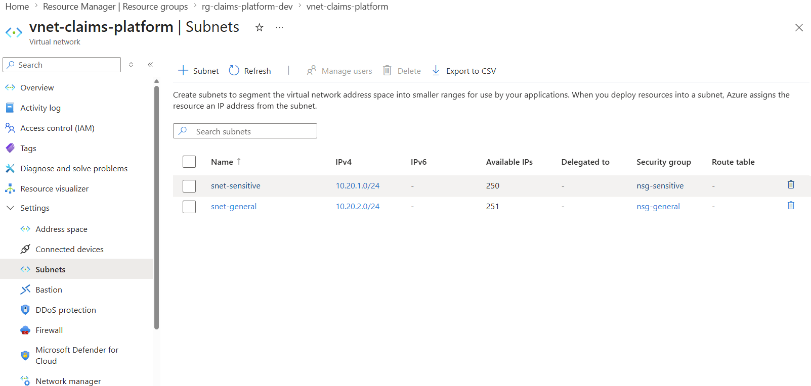

*Below: the sensitive zone's NSG inbound rules, showing the
`DenyAllInboundFromGeneral` rule — the actual rule enforcing the
segmentation, not just a claim in a README.*

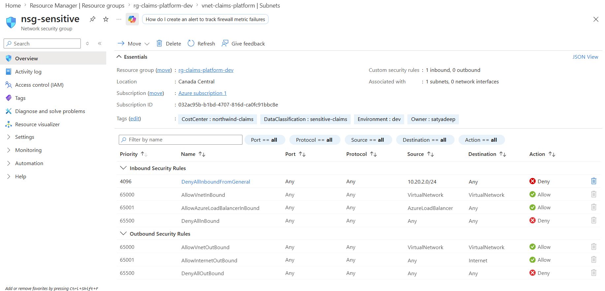

*Below: the claims-processor VM's overview, showing a private IP and no
public IP field populated — the deliberate no-public-IP design, confirmed.*

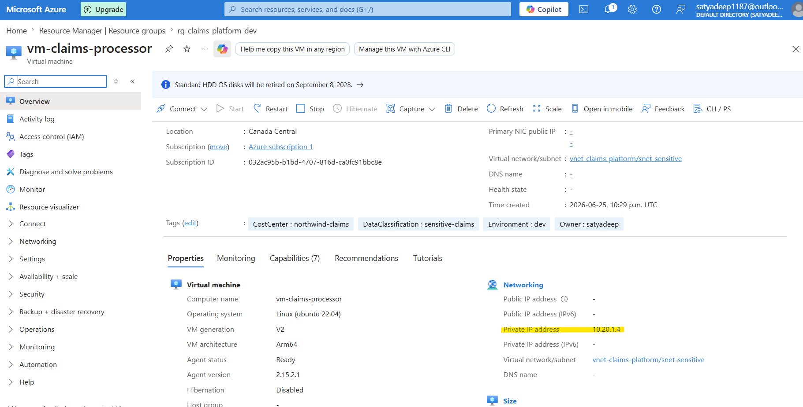

*Below: after the pipeline-driven deployment, the resource group as created
by the Release Pipeline (not the earlier local test) — the same resources,
now provisioned through the governed pipeline path.*

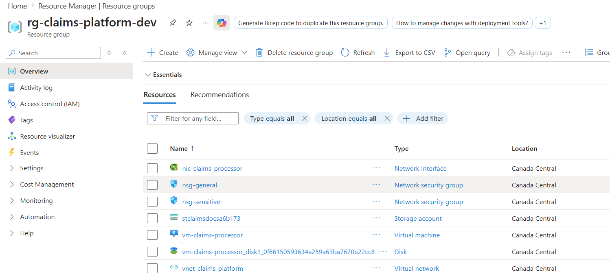

*Below: the deployed resources' policy compliance status, confirming they
satisfy the Canadian data-residency requirement they were created under.*

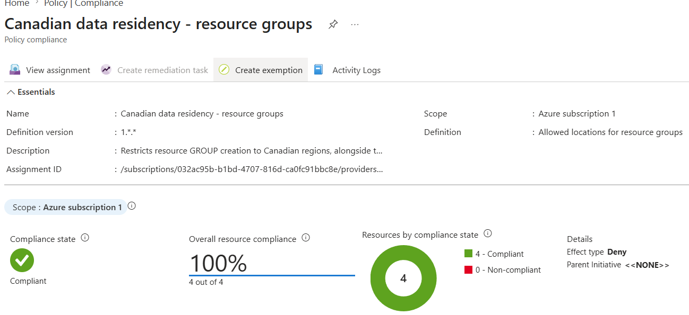

*Below: `terraform destroy` cleanly removing all resources after testing —
the teardown half of the lifecycle, proving nothing was left behind.*

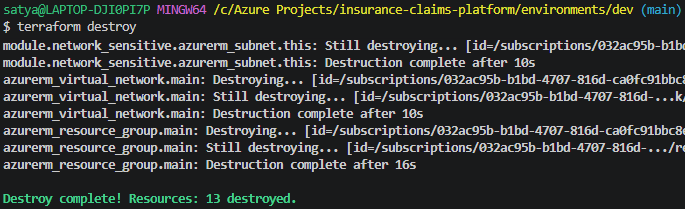

---

## Cost-conscious design

- The segmentation story is carried by subnets and NSGs, not by running a
  second VM — the general zone has no compute cost at all.
- The one real VM uses the smallest confirmed-available size on this
  subscription (`Standard_B2pls_v2`, ARM64 — the x86 burstable family is
  blocked on this free-trial subscription in `canadacentral`).
- Policy assignments cost nothing regardless of how many are active.
- The state backend and the pipeline's managed identity are the only
  genuinely persistent resources between sessions — both are pennies-level
  storage or free Azure AD objects, not compute.
- Every environment deployment in this project's history was torn down
  immediately after validation, confirmed via `az group list` before
  ending each session.

## What a production deployment would add

Named explicitly so the gap between this project and a real production
deployment is deliberate and explainable, not accidental:

- **Private endpoints** on the claims-documents storage account, so it has
  no public network path at all (currently network-restricted by policy,
  but not fully private).
- **Management-group-scope** policy assignment, for inheritance across many
  subscriptions in a larger organization (this project uses subscription
  scope, the pragmatic choice for a single-subscription account).
- **Hub-spoke networking with Azure Firewall**, per Microsoft's own AKS
  Baseline Architecture guidance — full enterprise network topology with
  centralized egress control.
- **DeployIfNotExists remediation**, actually wired up with the specific
  role assignments each PCI DSS sub-policy needs, rather than just the
  identity placeholder this project's audit-only assignment required.
- **Key Vault** for any real secrets a production workload would need,
  with Workload Identity integration rather than Terraform-generated,
  session-scoped credentials.
- **True multi-environment infrastructure** — separate staging and
  production resource groups or subscriptions, rather than one environment
  with an approval-workflow distinction.
- **IaC security scanning** (Checkov or tfsec) in the Build Pipeline,
  catching insecure Terraform before a plan is even generated.